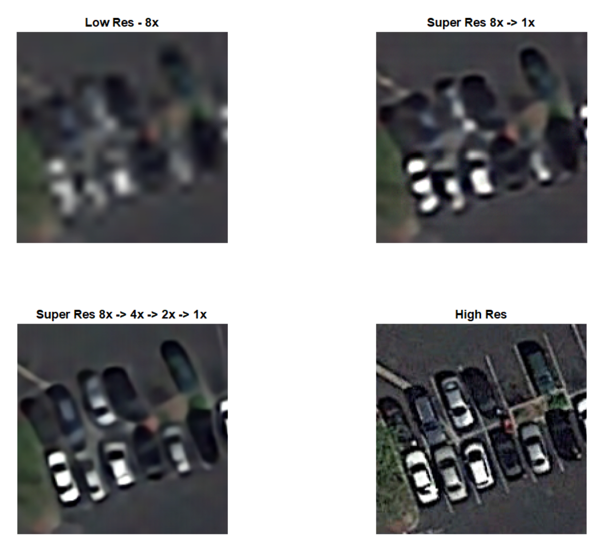
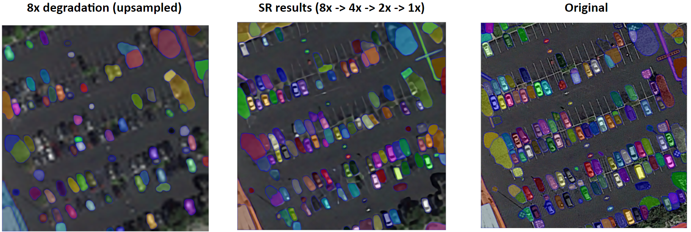
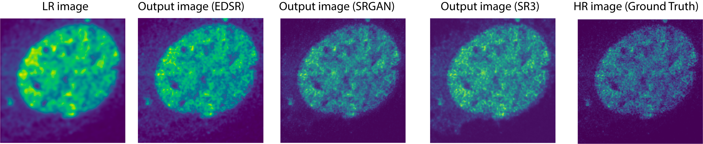

# ACV-S23-GroupProject - Fun With Super Resolution
Group project component for Applied Computer Vision done in Columbia University for Spring 2023.  
This repository looks at application of the Enhanced Deep Residual Networks (EDSR) for Super Resolution on the Aerial Imagery Dataset (AID).

## Setting up - 
1) Python, Google Colab
2) Linkup between GCP, Google Colab and Google Drive: https://medium.com/@uditsaini/access-google-drive-and-mount-google-drive-to-colab-notebook-google-ccbca1691d31
3) Matlab2022b: Used for evaluation of the models and the handcrafted control test.

## Location of AID material - 
1) Codes: ./Codebase/AID
2) Data: Download instructions in https://captain-whu.github.io/AID/. To place files in ./Data/AID/AIDoriginal

## Studies performed
We studied a few degradations of the image using bicubic interpolation, from 1x, 2x, 4x, 8x, on a subset of the AID dataset. 
Classes chosen:  
	  (Train) ['MediumResidential','Park','Parking','School','Square'], 
	  (Test) ['DenseResidential','SparseResidential']  
   
## Steps to reproduce experiment- 
1) Preprocessing (AID) 
	a) ./Codebase/AID/AID-DataPreprocessing.ipynb 
		Convert jpg to png, and construct lower resolution images of 2x and 4x. 
	b) ./Codebase/AID/AID-TrainTestSplit.ipynb 
		Splitting the data into Train, Valid, Test. Note a subset of the data is selected. 
	c) ./Codebase/AID/AID-checkfiles.ipynb 
		Checking the related folders to ensure all files are processed correctly. (Some possible issues with google drive due to lag). 
	d) ./Codebase/AID/SRGAN-TrainTestSplit.ipynb and AID-TrainTestSplitx8.ipynb 
		Preparing the data for SRGAN based on AID Train-Test split.  
	e) ./Codebase/AID/check_mean.m 
		(Matlab code) Used to check the mean and standard deviation of the training data.

2) Training (EDSR) - Updated with latest links 
e) 4x to 1x: ./Codebase/AID/AID-EDSR-04162023-4a.ipynb 
b) 8x to 1x: ./Codebase/AID/AID-EDSR-04162023-4c.ipynb 
c) 8x to 4x: ./Codebase/AID/AID-EDSR-04162023-4d.ipynb 
d) 4x to 2x: ./Codebase/AID/AID-EDSR-04162023-4e.ipynb 
e) 2x to 1x: ./Codebase/AID/AID-EDSR-04162023-4f.ipynb 

3) Results generation in multi stage 
a) 4x -> 2x -> 1x: ./Codebase/AID/(Eval4b)AID-EDSR-04162023-4.ipynb 
b) 8x -> 4x -> 2x -> 1x: ./Codebase/AID/(Eval4)AID-EDSR-04162023-4.ipynb 

4) Evaluation 
  a) ./Codebase/AID/(Quantitative4b)AID_EDSR_04162023_4.ipynb 
    Runs through each of the image set (Super-res, Low-res interpolated, High-res) and compare them to extract PSNR, LPIPS and SSIM.   
  b) ./Codebase/AID/QuantitativeResults_Consolidated.ipynb 
    Computes the mean and standard deviation of all extracted features.   
  c) ./Codebase/AID/compare_results.m 
    Compares visually the results in Matlab via a GUI. 
  d) Segment Anything Model (SAM) Demo in https://segment-anything.com/ 
    Produced the result that you see below. 
    

## Location of codes for super-resolution of fluorescence microscopy data 
1) Codes: ./Codebase/microscopy_code 
2) Data: Download data in https://doi.org/10.1038/s41592-018-0239-0  

## Steps to reproduce experiment for fluorescence microscopy data-  
Preprocessing, EDSR/SRGAN training, evaluation are all in ./Codebase/microscopy_code 

## Location of codes for super-resolution of celebA data
Codes: ./Codebase/sragan/srgan_face_data.ipynb ./Codebase/diffusion/diffusion_celebA.ipynb
Data: Download data in https://mmlab.ie.cuhk.edu.hk/projects/CelebA.html
## Steps to reproduce experiment for fluorescence microscopy data-
Preprocessing, SRGAN/SR3 training, evaluation are all in ./Codebase/sragan/srgan_face_data.ipynb ./Codebase/diffusion/diffusion_celebA.ipynb

Thanks for your interest in this topic!

References:
B. Lim, S. Son, H. Kim, S. Nah, K.M. Lee, Enhanced Deep Residual Network for Single Image Super-Resolution, CVPR 2017,  arXiv:1707.02921, July 2017  
G-S. Xia, J. Hu, F. Hu, B. Shi, X. Bai, Y. Zhong, L. Zhang, AID: A Benchmark Dataset for Performance Evaluation of Aerial Scene Classification, Aug 2016  
A. Kirillov, E. Mintun, N. Ravi, H. Mao, C. Rolland, L. Gustafson et al., Segment Anything, Meta AI Research, FAIR, April 2023
